Getting Started with Apiman
===========================

Apiman is a web-based API management tool that allows you to add an
extra layer of access control functionality to an API service, which
itself may not provide any.

You can use it to add authentication or IP filtering to control consumer
access, to limit the number of consumer requests within a given time
period by setting quotas, to analyse usage metrics, and more.

This tutorial will guide you through installation of Apiman on WildFly
and through basic configuration of an API provider and consumer with a
simple usage policy.

Preparing the environment
-------------------------

You need to prepare the Apiman by taking the following steps.

Additionaly, we are going to use Echo service as a demo implementation
provided by *apiman-quickstarts*, which will be prepared within just a
few more steps.

You will also need a HTTP client to test the configured policy, such as
curl, which we are going to use in examples.

**Important**

The environment that will result from the installation, takes advantage
of default configurations and it does not solve any security issues that
must be considered before production deployment!

### Prepare the *Apiman*

1.  Download the WildFly
    [10.1.0.Final](http://download.jboss.org/wildfly/10.1.0.Final/wildfly-10.1.0.Final.zip)
    and unpack the archive.
2.  Download the Apiman
    [1.4.3.Final](http://downloads.jboss.org/apiman/1.4.3.Final/apiman-distro-wildfly10-1.4.3.Final-overlay.zip)
    overlay for WildFly 10 and unpack archive contents into the WildFly
    directory.
3.  Launch the WildFly with the standalone Apiman configuration:
    `./bin/standalone.sh -c standalone-apiman.xml`

### Prepare the *Echo service*

1.  Clone the [apiman-quickstarts
    repository](https://github.com/apiman/apiman-quickstarts) (or
    download it as zip and unpack).
2.  Build it with Maven: `mvn clean install` (See the [Maven download
    site](https://maven.apache.org/download.cgi) if you need to install
    Maven first.)
3.  Launch the service locally, which will suffice for our purpose:
    `mvn jetty:run`

Logging in to the *Apiman* administration
-----------------------------------------

Open the [Apiman UI](http://localhost:8080/apimanui/) in your browser
and login with "`admin`" / "`admin123!`".

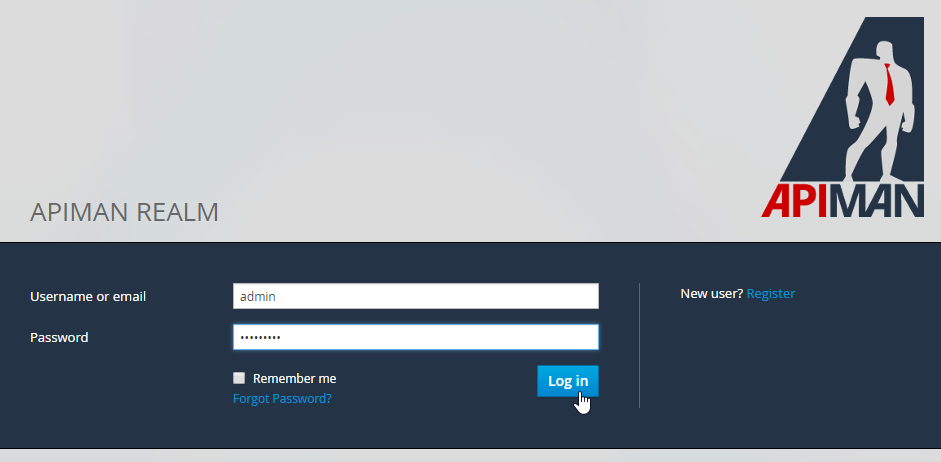

You will see the Apiman index page.

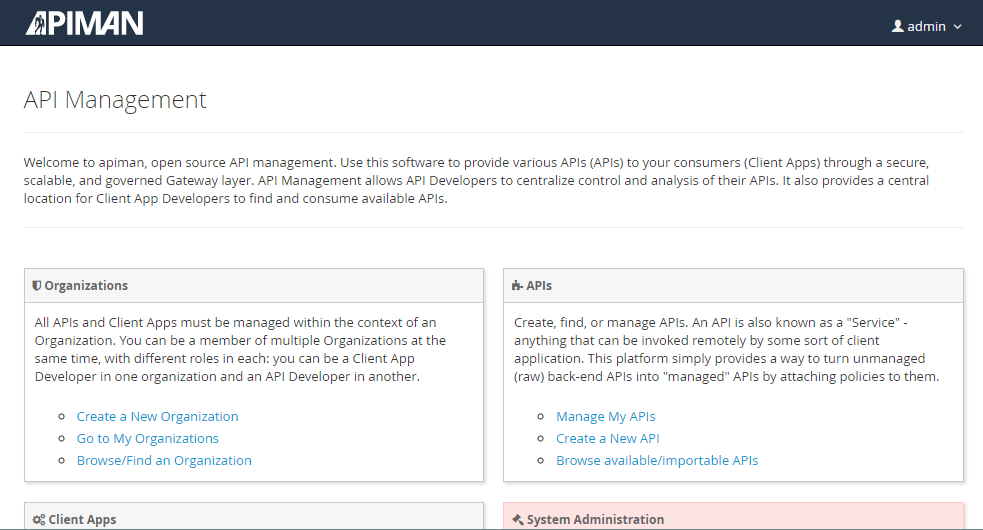

Configuring a simple API provider
---------------------------------

### Create an organization

1.  On the index page, click on the link Create a New Organization.

    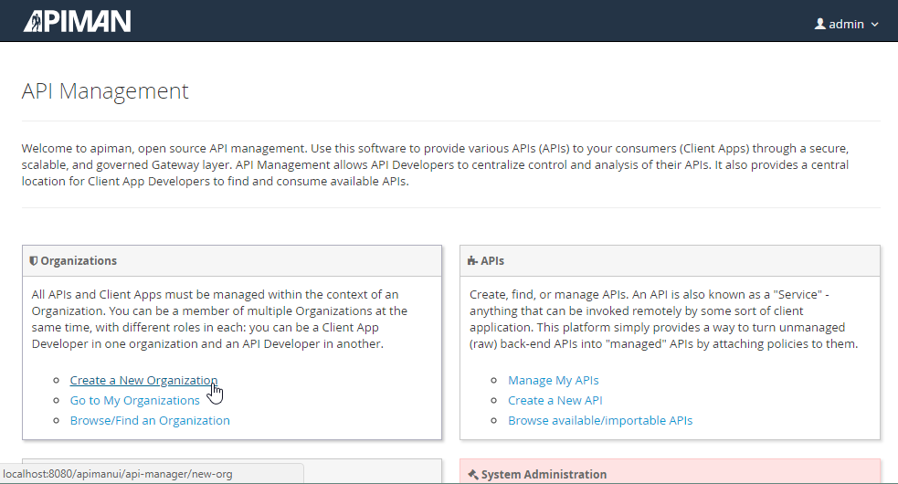

2.  Fill in an organization name, e.g. `EchoCompany`. Confirm by
    clicking on Create Organization.

    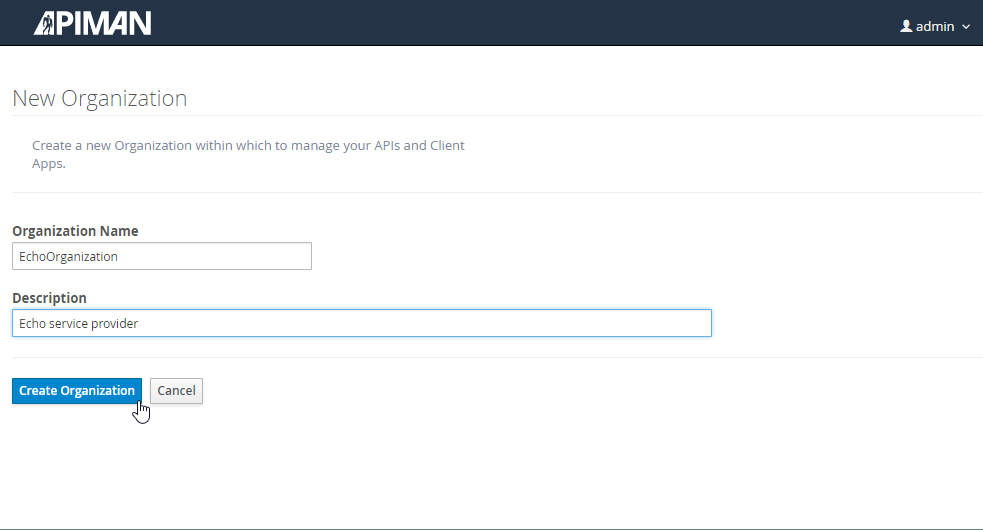

3.  You will see the page of your new organization.

### Create a plan

Now, we are going to set a policy plan for our future API. In general,
policy plans allow you to assign various policies to various consumers.
Let's say you want to set a quota.

1.  On the Plans tab, click on the New Plan button.

    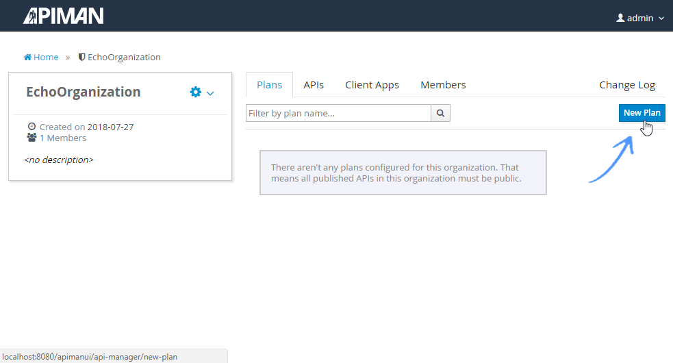

2.  Name the new plan, e.g. `EchoQuotaPlan`, and confirm by clicking on
    the Create Plan button.

    

3.  To add a policy to the plan, click on the Add Policy button.

    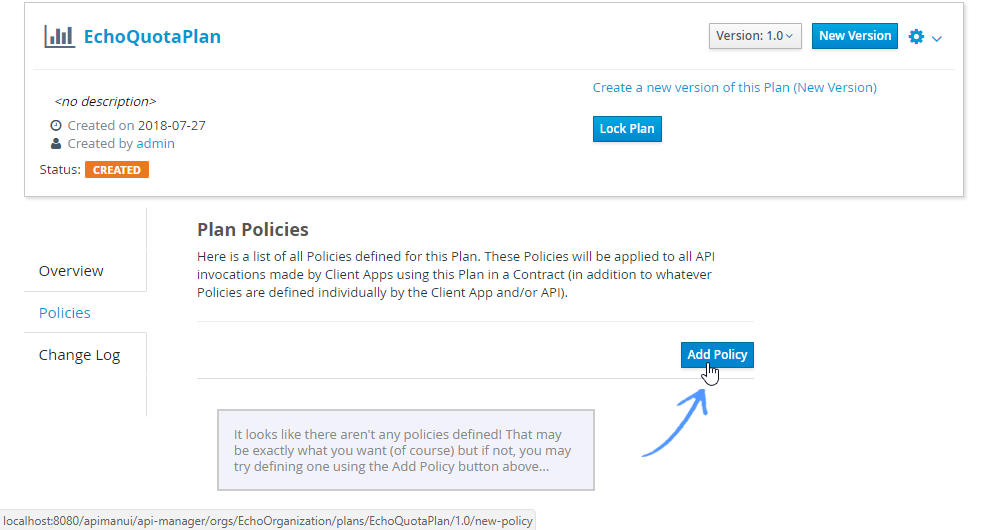

4.  Configure the policy:

    1.  Select the `Quota Policy` from the Policy Type drop-down menu.
    2.  Set the quota parameters, e.g. `10` requests per `Client App`
        per `Day`.
    3.  You may keep the default response headers. These will inform the
        client about how many requests are used, what is the maximum,
        and when the quota will be reset.
    4.  Confirm the configuration by clicking the Add Policy button.

    

5.  Lock the plan by clicking Lock Plan button, which will enable it for
    use in a contract with an API consumer.

    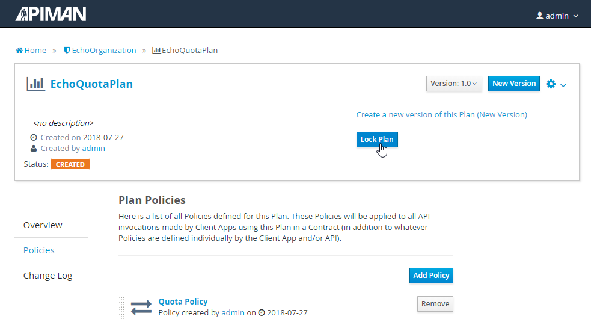

### Add an API

1.  On the *EchoOrganization* page, switch to the APIs tab and click on
    the New API button.

    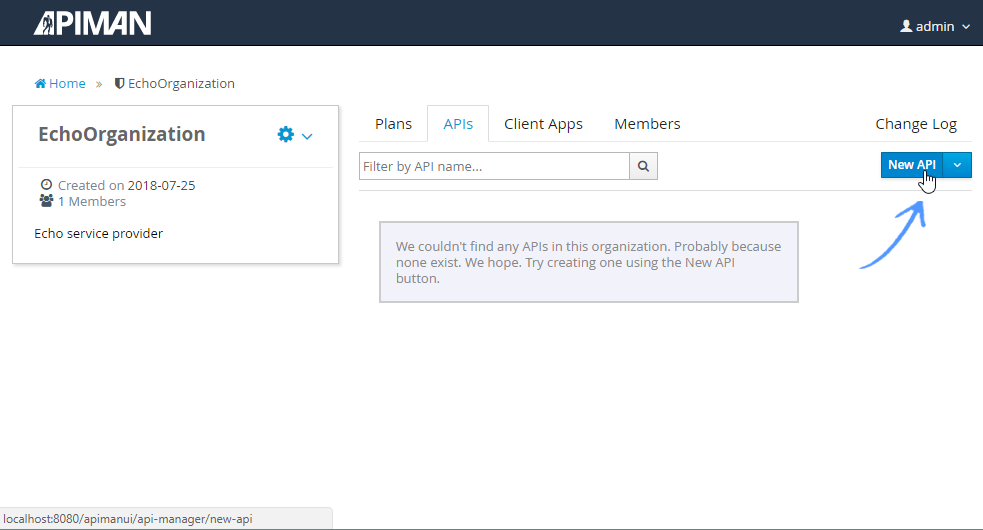

2.  Name the new API, e.g. `EchoAPI`. Confirm by clicking on Create API.

    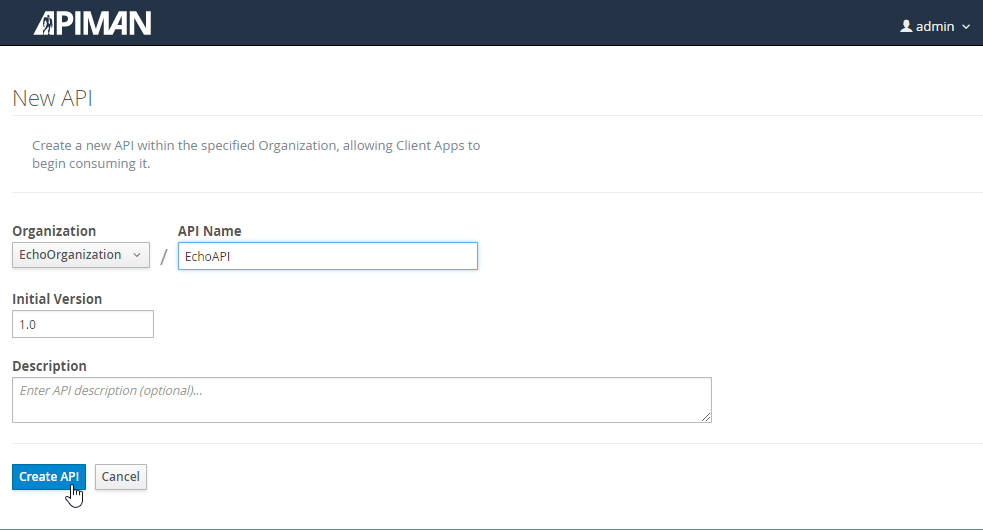

    You will see the page of the new API.

    

3.  Configure API implementation:
    1.  Switch to the Implementation tab and fill in the endpoint of the
        local Echo service instance: `http://localhost:9999/apiman-echo`

        Keep the other settings, because they fit the capabilities of
        this service.

        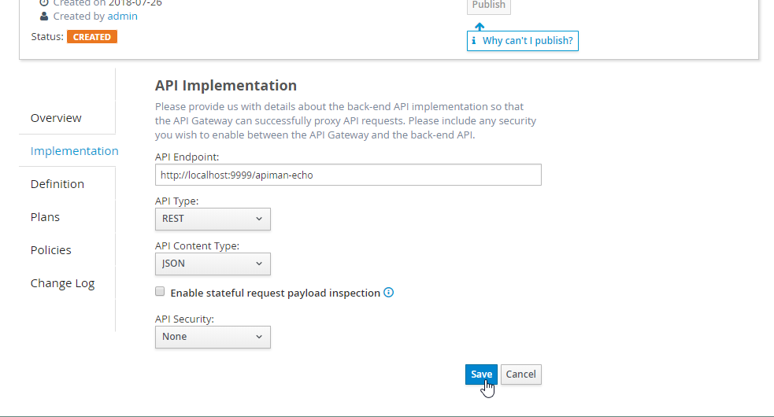

    2.  Save the settings by clicking on the Save button.

4.  Assign a plan so that the API can only be used privately -- switch
    to the Plans tab, check the `EchoQuotaPlan` we have set up before,
    and confirm by clicking on the Save button.

    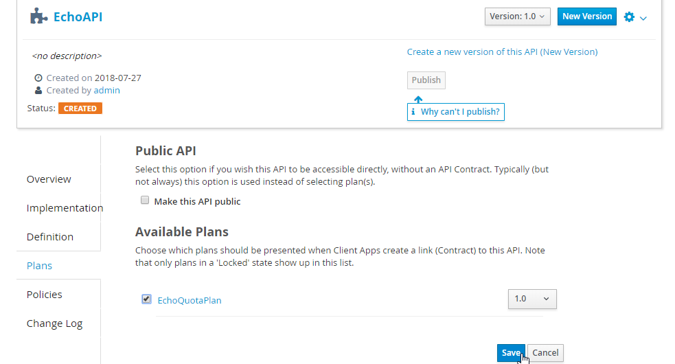

5.  Finally, publish the API to enable its use by clicking on the
    Publish button.

    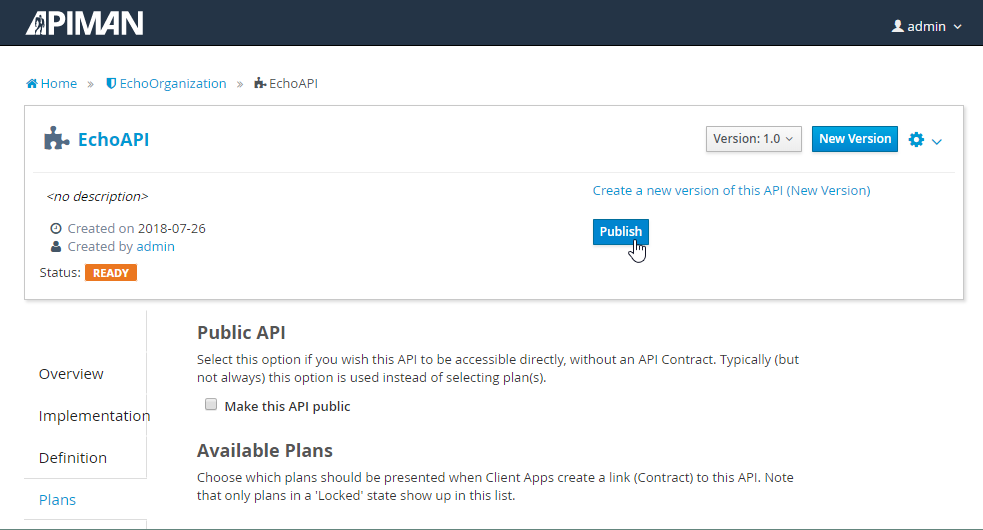

6.  The status of the API will change to `PUBLISHED`, which means that
    the API is now available.

Configuring a simple API consumer
---------------------------------

Add a consumer Create a contract (assign plan)

1.  On the *EchoOrganization* page, switch to the Client Apps tab and
    click on the New Client App button.

    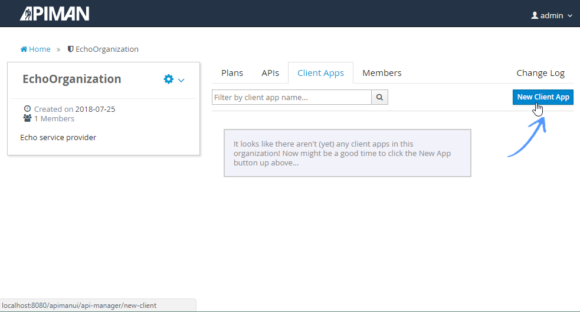

2.  Name the new client app (consumer), e.g. `EchoConsumer`. Confirm by
    clicking on Create Client App.

    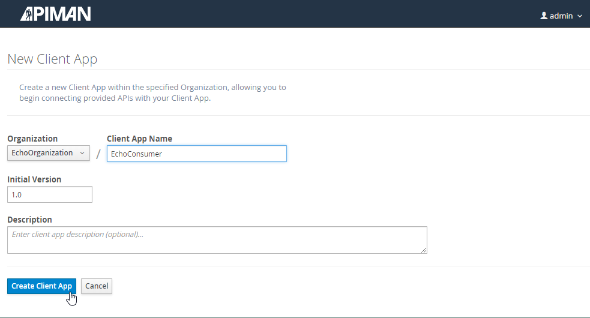

    You will see the home page of the new consumer.

3.  To assign an API with a policy plan, click on the link
    Create a new API Contract for this Client App.

    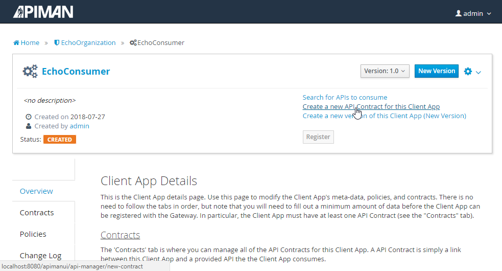

4.  Scroll down and click the Select API, then search the `EchoAPI`,
    select it in the results and confirm selection by clicking on OK.

    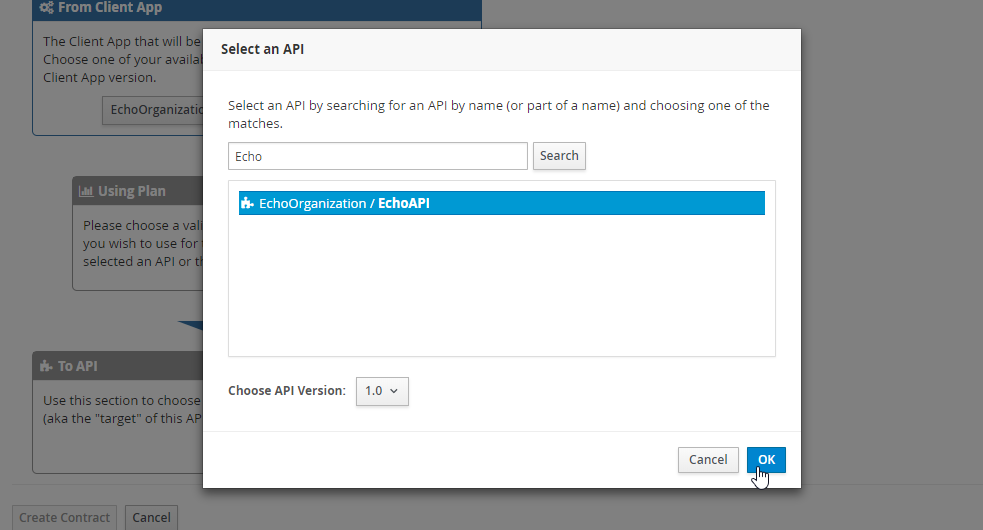

5.  Complete the contract by clicking on the Create Contract button.

    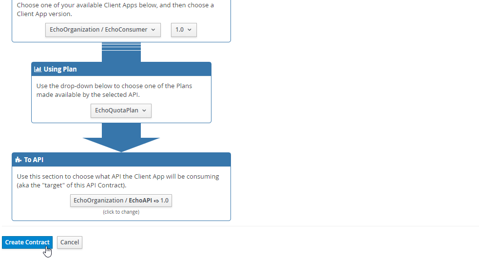

6.  Finally, register the consumer by clicking on the Register button.
    In this step, Apiman will generate a unique key, which the consumer
    will use to access the private API.

    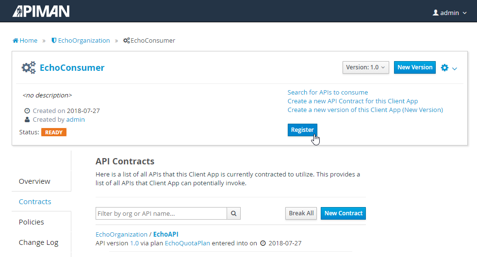

Testing the policy
------------------

First, find the API key -- on the *EchoConsumer* page, switch to the
APIs tab, where you can copy the key and the location of the API
endpoint.

**Note**

Apiman will generate a different key for you than the one that is used
in the following examples. Replace the key before you use the code.

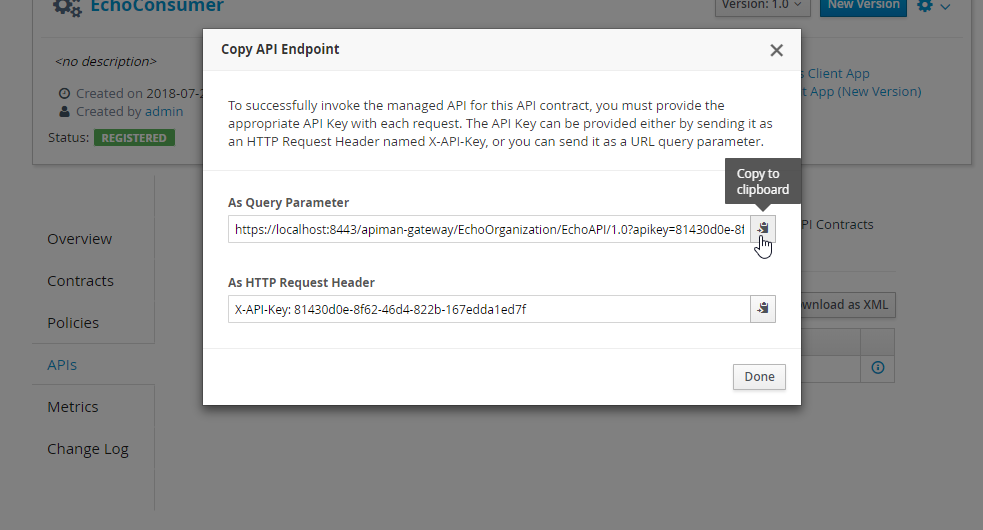

### Basic response

To check that you can get through to the Echo service, which was made
private and is proxied by the Apiman, use the Apiman-provided endpoint
and append a regular Echo service path, for example:

```
curl -k -H "X-API-Key: 81430d0e-8f62-46d4-822b-167edda1ed7f" -X GET https://localhost:8443/apiman-gateway/EchoOrganization/EchoAPI/1.0/hello
```

```
{
  "method" : "GET",
  "resource" : "/apiman-echo/hello",
  "uri" : "/apiman-echo/hello",
  "headers" : {
    "Accept" : "*/*",
    "User-Agent" : "curl/7.55.1",
    "Connection" : "keep-alive",
    "Host" : "localhost:9999",
    "Accept-Encoding" : "gzip"
  },
  "bodyLength" : null,
  "bodySha1" : null
}
```

### Quota information

To check the quota consumption, view the response headers, for example:

```
curl -k -H "X-API-Key: 81430d0e-8f62-46d4-822b-167edda1ed7f" --head https://localhost:8443/apiman-gateway/EchoOrganization/EchoAPI/1.0/hello
```

```
HTTP/1.1 200 OK
X-Powered-By: Undertow/1
X-Quota-Remaining: 6
Server: WildFly/10
Server: Jetty(9.3.0.v20150612)
X-Quota-Limit: 10
Date: Thu, 26 Jul 2018 22:37:57 GMT
X-Quota-Reset: 84122
Connection: keep-alive
Content-Type: application/json
Content-Length: 320
```

Further reading
---------------

[User Guide](https://apiman.gitbooks.io/apiman-user-guide/)
